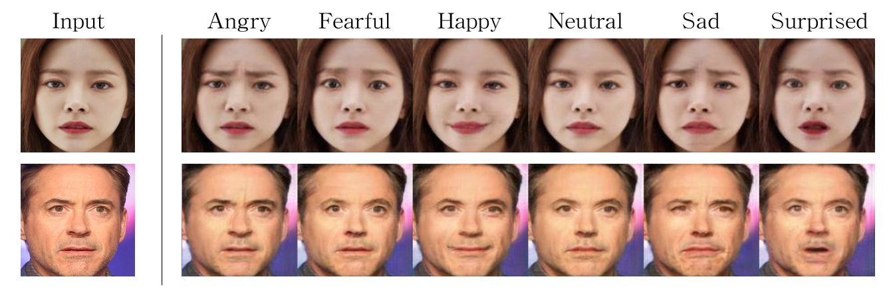
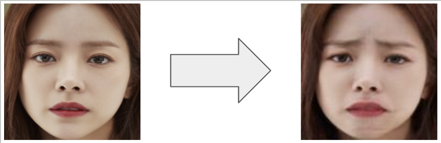
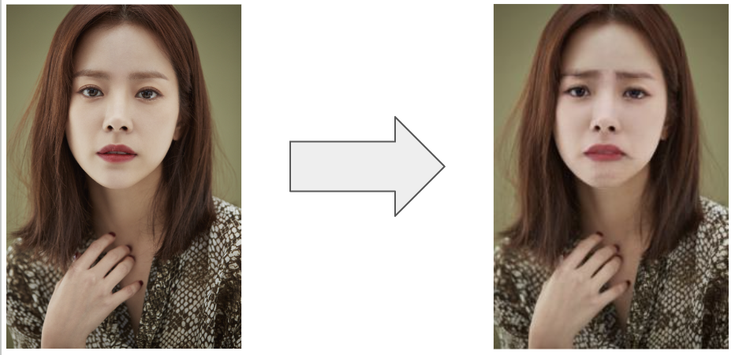

# StarGAN-TA(StarGAN with Transfer Learning and changed Activation function)



"GAN, the most representative model in image generation, has made significant advancements and found various applications in different fields. StarGAN addresses the problem of having to construct separate models for each domain, allowing one model to learn and transform across multiple domains. Based on this, numerous studies have been conducted on image transformations. Among them, emotion generation research is a technology for human emotional expression and interaction, widely applicable in various fields. In this paper, we directly collect data on six selected facial expressions for emotion-based image transformation. We propose StarGAN-TA, applying transfer learning to the StarGAN model, to achieve improved image transformations."

This repository follows the official PyTorch implementation of the following paper:

> **StarGAN: Unified Generative Adversarial Networks for Multi-Domain Image-to-Image Translation**<br>
> [Yunjey Choi](https://github.com/yunjey)<sup>1,2</sup>, [Minje Choi](https://github.com/mjc92)<sup>1,2</sup>, [Munyoung Kim](https://www.facebook.com/munyoung.kim.1291)<sup>2,3</sup>, [Jung-Woo Ha](https://www.facebook.com/jungwoo.ha.921)<sup>2</sup>, [Sung Kim](https://www.cse.ust.hk/~hunkim/)<sup>2,4</sup>, [Jaegul Choo](https://sites.google.com/site/jaegulchoo/)<sup>1,2</sup>    <br/>
> <sup>1</sup>Korea University, <sup>2</sup>Clova AI Research, NAVER Corp. <br>
> <sup>3</sup>The College of New Jersey, <sup>4</sup>Hong Kong University of Science and Technology <br/>
> https://arxiv.org/abs/1711.09020 <br>
>
> **Abstract:** *Recent studies have shown remarkable success in image-to-image translation for two domains. However, existing approaches have limited scalability and robustness in handling more than two domains, since different models should be built independently for every pair of image domains. To address this limitation, we propose StarGAN, a novel and scalable approach that can perform image-to-image translations for multiple domains using only a single model. Such a unified model architecture of StarGAN allows simultaneous training of multiple datasets with different domains within a single network. This leads to StarGAN's superior quality of translated images compared to existing models as well as the novel capability of flexibly translating an input image to any desired target domain. We empirically demonstrate the effectiveness of our approach on a facial attribute transfer and a facial expression synthesis tasks.*

* Setting up a virtual environment using ''conda''

  NAME is virtual environment Name. User can set this one. ex)StarGAN, virtual_star, ... 

  python version is 3.7 

  ```terminal
  conda create -n NAME python 3.7
  conda activate NAME
  ```

* git clone 

  ```terminal
  git clone https://github.com/shp216/StarGAN-TA.git
  ```

  

* Download requirements.txt

  ```terminal
  pip install -r requirements.txt
  ```

  


* Data Composition

  We compose data for 6 facial expressions. If want to add more facial expressions like (annoyed, scared), add data folder in the same location(--rafd_image_dir). Empirically we find out that more than 500 pictures are needed for good results.

  For the training data, place the data corresponding to the labeled expressions in each labeled folder. In this process, the data should be cropped around the face. For data preprocessing, you can use 'datapreprocess.py.' The 'image_preprocess_SIZE' function resizes the image to SIZE and crops the facial area, while the 'image_resize_SIZE' function only resizes the image to SIZE. Functions are provided for SIZE values of 64, 128, 256, and 512, respectively.

  For testing data, if you want to conduct testing on cropped images, place the cropped images you want to inference in the 'person' folder. If you want to conduct testing on the original images without cropping, place the original images you want to inference in the 'origin_person' folder

  - Own StarGAN Folder(Our name is stargan_new_6_leaky)

    - Data

      - train

        - happy
        - sad
        - surprised
        - neutral
        - fearful
        - Angry
      
      - test
      
        - person
      
        - origin_person
      
          
      
        

* Using Pretrained Model

  https://drive.google.com/file/d/1g8QCW5h3MSiT1tirDEfUzarRT_5y3HQ8/view?usp=sharing

  You can use trained model weight from link. test_iter is 330000 for Discriminator and Generator.

  To perform testing, place the model weights in stargan_new_6_leaky/models. When using a pretrained model, set the 'test_iter' to 330000 and proceed with the testing.

* Training

  ``` cmd
  python3 main.py --mode train --data RaFD --image_size 128 \ 
  --model_save_dir='stargan_new_6_leaky/models' \
  --result_dir='stargan_new_6_leaky/result' \ 
  --rafd_image_dir='stargan_new_6_leaky/data/train' \
  --sample_dir='stargan_new_6_leaky/samples' \
  --sample_label_dir='stargan_new_6_leaky/data/train'
  ```

  

* Test

  2 modes for this model(test data location is fixed so we notify test data location in code.)

  The size of the input image is not constrained by the model; it is resized to the image size value specified within the model during operation

  1. Change face attribution(ex. Smile, sad, ..) for one person(cropped image) - person

     

     ```cmd
     python3 main.py --mode test --data RaFD --image_size 128 \
     --model_save_dir='stargan_new_6_leaky/models' \
     --result_dir='stargan_new_6_leaky/results' \
     --sample_dir='stargan_new_6_leaky/samples' \
     --sample_label_dir='stargan_new_6_leaky/data/train' \
     --test_mode person \
     --test_iters 330000
     ```

     

  2. Change face attribution for one person(No need to crop) - origin_person

     

     ```cmd
     python3 main.py --mode test --data RaFD --image_size 128 \
     --model_save_dir='stargan_new_6_leaky/models' \
     --result_dir='stargan_new_6_leaky/results' \
     --sample_dir='stargan_new_6_leaky/samples' \
     --sample_label_dir='stargan_new_6_leaky/data/train' \
     --test_mode origin_person \
     --test_iters 330000
     ```

     

  Inferenced results are saved in args.result_dir -> user can set the directory

  

  

